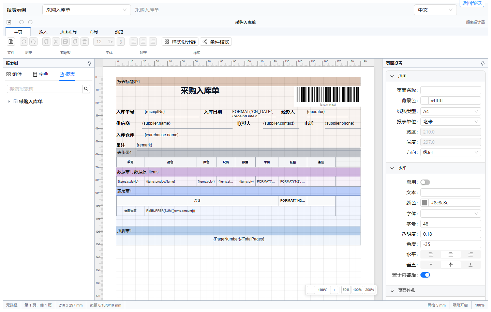
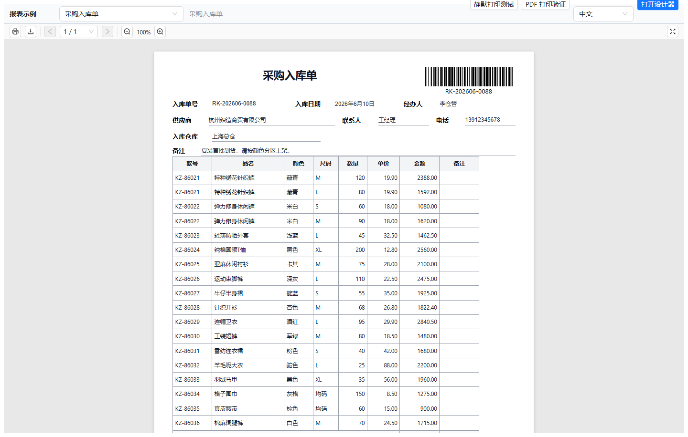

# Report Designer

[中文](./README.zh-CN.md) | [User Guide](./docs/user-guide/README.md)

Report Designer is an embeddable React report designer, previewer, and print/PDF toolkit for business documents. It helps product teams build report templates visually, bind them to JSON data, preview paginated output in the browser, and integrate printing workflows into ERP, CRM, WMS, retail, and back-office systems.

## Screenshots

### Designer



### Print Preview



## Product Highlights

- Visual report design with a canvas, rulers, bands, report tree, component palette, and property panels.
- Business-document layout primitives for headers, data bands, tables, rich text, barcodes, QR codes, charts, page numbers, and watermarks.
- Data-driven rendering from JSON dictionaries, expressions, grouping, aggregates, conditional formats, and event scripts.
- Browser preview with pagination that is designed to match print and PDF output.
- PDF export, browser print, and Chrome extension printing flow for controlled environments.
- React component packages that can be embedded into existing applications instead of shipping a separate designer product.
- Chinese and English UI support for product teams serving mixed-language users.

## Use Cases

Report Designer is a good fit when your application needs editable, printable business documents:

- ERP and WMS documents such as purchase orders, inbound/outbound warehouse forms, picking lists, and transfer orders.
- Retail and membership reports such as sales summaries, member consumption statements, receipts, and product hang tags.
- Finance and operations documents such as contracts, settlement sheets, reconciliation reports, and daily business dashboards.
- SaaS admin consoles that need tenant-specific print templates without redeploying frontend code.
- Internal systems that need PDF export, browser printing, or silent printing from controlled desktop environments.

## Packages

| Package | Purpose |
| --- | --- |
| `@report-designer/core` | Template model, data dictionary, expression engine, pagination, layout, rendering, events, charts, tables, and shared runtime logic. |
| `@report-designer/designer` | React visual designer components and designer state. |
| `@report-designer/viewer` | React preview components, DOM rendering, print helpers, PDF export, and Chrome extension print integration. |
| `@report-designer/example` | Local Vite example app with sample templates and integration demos. |

## Quick Start

```bash
pnpm install
pnpm --filter @report-designer/example dev
```

Open the local Vite URL, choose a sample template, switch between preview and designer, then edit the template and return to preview to see the rendered result.

## Install In Your App

`@report-designer/core`, `@report-designer/designer`, and `@report-designer/viewer` declare React, React DOM, Ant Design, and Zustand as **peer dependencies**. They are never bundled into the packages, so you must install them yourself in your application. This lets Report Designer reuse the versions your app already ships instead of duplicating them.

```bash
pnpm add @report-designer/core @report-designer/designer @report-designer/viewer
pnpm add react react-dom antd zustand
```

If you only use the `core` package (for example to render reports server-side), you do not need Ant Design or Zustand — only `core` and React.

| Package | Required peer dependencies |
| --- | --- |
| `@report-designer/core` | — |
| `@report-designer/designer` | `react`, `react-dom`, `antd@^6`, `zustand@^5` |
| `@report-designer/viewer` | `react`, `react-dom`, `antd@^6` |

```tsx
import { useState } from 'react';
import type { ReportTemplate } from '@report-designer/core';
import { Designer } from '@report-designer/designer';
import { Viewer } from '@report-designer/viewer';

function ReportWorkspace({ initialTemplate, data }: { initialTemplate: ReportTemplate; data: unknown }) {
  const [template, setTemplate] = useState(initialTemplate);

  return (
    <>
      <Designer template={template} data={data} onTemplateChange={setTemplate} />
      <Viewer template={template} data={data} />
    </>
  );
}
```

The exact integration depends on whether you want a designer-only screen, a preview-only screen, or a combined editing workflow. See the [User Guide](./docs/user-guide/README.md) for the planned documentation structure.

## Chrome Extension and Silent Printing

Report Designer includes a Chrome print bridge for scenarios where a web app needs to send print jobs to managed printers with fewer manual steps.

The print bridge contains:

- A Chrome extension in [`extensions/chrome-silent-print`](./extensions/chrome-silent-print/README.md).

Typical flow:

1. The viewer renders a report into a print document or PDF payload.
2. `@report-designer/viewer` sends the job to the Chrome extension.
3. The extension submits the PDF through Chrome's `chrome.printing` API.
4. Chrome sends the job to a configured printer.

```tsx
<Viewer
  template={template}
  data={data}
  printOptions={{
    adapter: 'chrome-extension',
    chromeExtension: {
      backend: 'chromePrinting',
      printerId: 'printer-01',
      silent: true,
    },
  }}
/>
```

Use this path for controlled desktops, store counters, warehouse workstations, and other environments where printers are managed by the organization. For normal browser usage, the viewer can still use standard browser print and PDF export.

## Documentation

- [Getting Started](./docs/user-guide/getting-started.md)
- [Designer](./docs/user-guide/designer.md)
- [Data Binding](./docs/user-guide/data-binding.md)
- [Expressions](./docs/user-guide/expressions.md)
- [Custom Variables and Functions](./docs/user-guide/custom-expressions.md)
- [Events](./docs/user-guide/events.md)
- [Preview and Print](./docs/user-guide/preview-and-print.md)
- [PDF Export](./docs/user-guide/pdf-export.md)
- [Chrome Extension](./docs/user-guide/chrome-extension.md)
- [Silent Printing](./docs/user-guide/silent-printing.md)
- [Templates](./docs/user-guide/templates.md)
- [API Reference](./docs/user-guide/api-reference.md)
- [FAQ](./docs/user-guide/faq.md)

## Development

```bash
pnpm install
pnpm build
pnpm test
```

Useful package-level commands:

```bash
pnpm --filter @report-designer/core test
pnpm --filter @report-designer/designer test
pnpm --filter @report-designer/viewer test
pnpm --filter @report-designer/example dev
```

## Release Status

The package version is currently `0.1.0`. The project is being prepared for GitHub and npm publication, so APIs may still change before the first stable release.
