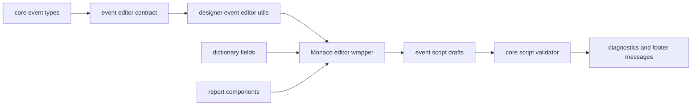

# Phase 24: Monaco Event Editor Design

## Goal

Upgrade the event editor from a plain text area to a Monaco-based script editor with typed `ctx` IntelliSense, localized helper guidance, validation feedback, and a structure that can grow with future report events without coupling the designer to the runtime implementation.

## Scope

1. Replace the script text area in the event dialog with a lazy-loaded Monaco editor.
2. Provide type hints for `ctx`, including event mode, target metadata, row data, parameters, variables, log helpers, mutation helpers, dynamic component creation helpers, and value helpers.
3. Narrow `ctx` hints by target and event where useful, for example component `getValue` should prominently expose `ctx.setValue(value)`.
4. Keep existing script storage and runtime execution unchanged.
5. Keep the existing security validator as the source of truth for blocked syntax and runtime restrictions.
6. Add localized helper descriptions and snippet insertion for Chinese and English.
7. Make the event editor extensible for future helpers, event names, and typed dictionary fields.

## Non-Goals

- Running scripts inside the designer.
- Adding asynchronous event execution.
- Changing the report event lifecycle.
- Inferring exact row field types from arbitrary JSON at runtime.
- Replacing the existing event script validator.
- Adding chart-related event helpers.

## Current Context

The current event editor is implemented in `packages/designer/src/components/events/EventEditorDialog.tsx`. It uses:

- `Input.TextArea` for script editing.
- `event-editor-utils.ts` for target event names, helper snippets, normalization, and validation forwarding.
- `validateEventScript` from `@report-designer/core` for static safety checks.
- `EventContext` and dynamic component option types in `packages/core/src/event-engine/types.ts`.

This already gives a clean runtime boundary. The missing layer is an editor-facing contract that can be consumed by Monaco without forcing Monaco into the core package.

## Recommended Approach

Use a thin designer wrapper around Monaco and keep the event script API contract owned by the core package.

The core package should export an editor contract module that contains:

- A `.d.ts` string for the script environment.
- Target/event-specific context type names.
- Helper metadata with labels, documentation keys, and insert snippets.

The designer package should own:

- The React Monaco wrapper.
- Modal layout.
- Completion provider registration.
- Dictionary/component tree insertion.
- Localization of helper descriptions.

This keeps runtime event behavior independent from the editor, while still preventing the type hints from drifting away from the public `ctx` API.

## Architecture



### Core Event Editor Contract

Create a small core module responsible for editor-facing definitions:

- `packages/core/src/event-engine/event-editor-contract.ts`
- Export `EVENT_SCRIPT_DTS`.
- Export `eventEditorContextTypes`.
- Export helper descriptors that do not contain UI language strings.

The declaration should define:

```ts
declare const ctx: EventContext;

interface EventContext {
  mode: 'preview' | 'print' | 'pdf';
  target: EventTargetState;
  row?: Record<string, unknown>;
  rowIndex?: number;
  dataSourceId?: string;
  data: Record<string, unknown>;
  parameters?: Record<string, unknown>;
  variables?: Record<string, unknown>;
  state: Record<string, unknown>;
  log: EventLogCollector;
  cancel?: () => void;
  hide?: () => void;
  setValue?: (value: unknown) => void;
  getComponent?: (idOrName: string) => ReportComponent | undefined;
  setComponentProperty?: (idOrName: string, path: string, value: unknown) => void;
  bindText?: (idOrName: string, expression: string) => void;
  createText?: (options: DynamicTextOptions) => TextComponent;
  createImage?: (options: DynamicImageOptions) => ImageComponent;
  createBarcode?: (options: DynamicBarcodeOptions) => BarcodeComponent;
}
```

For better hints, provide target/event-specific declarations:

- `ReportEventContext`
- `BandEventContext`
- `ComponentEventContext`
- `ComponentGetValueEventContext`

When the active event changes, the designer should switch the virtual editor model header from `declare const ctx: EventContext` to the narrowest matching context type.

### Monaco Wrapper

Create `packages/designer/src/components/events/EventScriptEditor.tsx`.

Responsibilities:

- Lazy load `@monaco-editor/react` so Monaco code is only fetched when the event dialog opens.
- Configure JavaScript diagnostics and IntelliSense in Monaco `beforeMount`.
- Add the core `.d.ts` content through Monaco's extra library API.
- Register completion providers for helpers, fields, components, and common snippets.
- Dispose extra libraries and providers on unmount to avoid duplicate completions.
- Render a lightweight loading state while Monaco loads.

Use JavaScript mode, not TypeScript mode, because event scripts are stored and executed as JavaScript snippets. Enable check-style diagnostics through Monaco JavaScript defaults so plain JS still receives type hints.

### Editor Model Strategy

Each active event should get a stable virtual URI:

```ts
inmemory://event-scripts/{targetType}/{eventName}.js
```

The editor content should be the user's script only. The `ctx` declaration should come from extra libraries, not hidden text prepended to the model. This avoids changing saved script text and keeps diagnostics line numbers aligned with what the user sees.

### Completion and Snippets

The completion provider should include four groups:

1. `ctx` helpers: `ctx.log.info`, `ctx.hide`, `ctx.cancel`, `ctx.setValue`, `ctx.bindText`, `ctx.createText`, `ctx.createImage`, `ctx.createBarcode`.
2. Data fields: insert `{DataSource.Field}` for expression-oriented use and `ctx.row.FieldName` for row-oriented event scripts.
3. Components: insert component name/id for `ctx.getComponent`, `ctx.bindText`, and `ctx.setComponentProperty`.
4. Event examples: target-specific snippets, such as hide current component, dynamically bind a field, create a badge, or override value.

Helper metadata should use stable keys and be localized in `packages/designer/src/i18n/messages.ts`.

### Validation Flow

The Validate button should run two checks:

1. Monaco syntax markers for JavaScript syntax and type diagnostics.
2. Existing core `validateEventScript(script)` for blocked tokens and runtime restrictions.

The footer should merge both result types into a concise localized message:

- No issues: validation passed.
- Monaco syntax/type issues: show line and message.
- Runtime validator issues: show the existing validator message.

Saving should continue to block only on the core validator and syntax-level Monaco errors. Type warnings should be visible but not block saving because JSON data shape is not always statically knowable.

### Dialog Layout

Use a wider modal with a stable three-column layout:

- Left: event list, compact, target-specific.
- Center: enabled switch, Monaco editor, validation footer.
- Right: searchable helper tree with fields, components, and examples.

The editor area should have a fixed minimum height around 420 px and grow within the modal. The helper tree should scroll internally. The right helper panel should keep the same search-box style as the rest of the left-side panels.

### Extensibility

Future additions should only require changes in one or two places:

- New event name: add to core event type and `eventNamesByTarget`.
- New helper: add to the core helper descriptor list and localized designer messages.
- New dynamic component helper: add the runtime helper, option interface, `.d.ts` contract, and a snippet.
- Stronger dictionary typing: add optional generated interfaces from the selected JSON dictionary, then narrow `ctx.row` for the active DataBand.

The Monaco wrapper should not hardcode report component kinds beyond display labels and snippet choices.

### Safety

Monaco is an editing aid only. It must not weaken runtime safety.

- Continue blocking restricted tokens in `validateEventScript`.
- Do not expose browser globals as approved API in helper snippets.
- Do not execute scripts inside the editor.
- Do not serialize editor-only metadata into the report template.

### Internationalization

Add Chinese and English strings for:

- Editor loading state.
- Monaco unavailable fallback.
- Type warning labels.
- Helper group names.
- Helper descriptions.
- Snippet labels.
- Validation summary.

Existing event names should remain localized through the current event message keys.

### Testing Strategy

Core tests:

- Contract exports include `declare const ctx`.
- Contract includes all current runtime helpers.
- Helper descriptors cover every helper in the declaration.

Designer tests:

- Event dialog renders the Monaco wrapper when open.
- Script changes still update the active draft.
- Switching event changes active event without losing drafts.
- Helper insertion appends snippet text.
- Validation merges core validator errors with editor diagnostics.
- Chinese and English helper labels render correctly.

Because Monaco itself is heavy in jsdom, tests should mock `@monaco-editor/react` and test our wrapper contract, props, and provider utilities. A browser smoke check can verify the real editor opens in the example app after implementation.

## Acceptance Criteria

1. Opening any report, band, or component event dialog shows the Monaco editor instead of a text area.
2. Typing `ctx.` shows completions for the event context helpers.
3. Hovering or selecting helpers shows localized descriptions.
4. Data fields and components can be inserted from the right helper tree.
5. The `getValue` event prominently hints `ctx.setValue(value)`.
6. Validation still catches blocked syntax from the existing validator.
7. Saving event scripts stores the same plain script string as before.
8. Preview, print, and PDF event behavior remains unchanged.
9. The editor can load lazily and does not increase the initial designer render path.
10. Chinese and English UI text are both covered.

## Open Decisions Resolved

- Use JavaScript editor mode with TypeScript-powered diagnostics because event scripts are JavaScript snippets.
- Own editor UI in designer; own script API contract in core.
- Do not make type warnings blocking for save.
- Use lazy loading to control bundle cost.
- Keep the runtime validator as the authority for safety.

