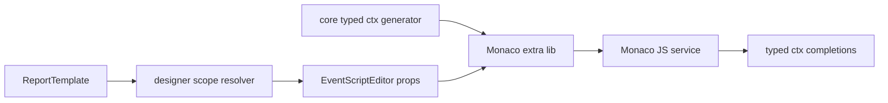

# Phase 25: Typed Event Context IntelliSense Design

## Goal

Upgrade the event script editor so Monaco can offer field-aware hints for `ctx.row`, `ctx.data`, `ctx.parameters`, and `ctx.variables` based on the current report template. This phase improves authoring confidence without changing event execution, report rendering, preview, print, or PDF behavior.

## Current Gap

Phase 24 introduced Monaco and a typed base `ctx`, but data-related properties still use generic shapes:

- `ctx.row?: Record<string, unknown>`
- `ctx.data: Record<string, unknown>`
- `ctx.parameters?: Record<string, unknown>`
- `ctx.variables?: Record<string, unknown>`

That is safe, but users still need to remember field names manually. The report already has `DataSource.fields/schema` and `ReportParameter[]`, and DataBand already knows `dataBand.dataSourceId`. The editor should use that information to provide concrete hints.

## Scope

1. Generate editor-only TypeScript declarations from `ReportTemplate.dataSources` and `ReportTemplate.parameters`.
2. Narrow `ctx.row` to the current DataBand row type when the event belongs to a DataBand or a component inside a DataBand.
3. Type `ctx.data.<sourceId>` as arrays of row objects.
4. Type `ctx.parameters.<name>` according to report parameter type.
5. Keep `ctx.variables` extensible while documenting known system variables.
6. Add completions for `ctx.row.<field>`, `ctx.data.<source>`, and `ctx.parameters.<name>`.
7. Preserve existing expression insertion behavior such as `{employees.salary}`.

## Non-Goals

- Runtime validation of script field names.
- Changing how JSON data is loaded or rendered.
- Inferring types from live data rows when the template already has schema fields.
- Full nested object path typing. Nested JSON arrays continue to be modeled as separate data sources.
- Breaking existing scripts that use `ctx.row["field"]` or dynamic parameter names.

## Recommended Approach

Use editor-only declaration generation in core, and pass template-aware metadata from designer into `EventScriptEditor`.

The core package should own deterministic conversion from template dictionary metadata to `.d.ts` strings. The designer should own scope resolution: report events get all data sources but no active row; Band events use the selected band data source; component events use the component's containing band data source.

This keeps data typing reusable and testable, while avoiding runtime coupling.

## Alternatives Considered

### A. Designer-only generator

The designer could generate all declarations locally. This is fast to implement but risks drifting away from core template model types and makes tests less authoritative.

### B. Runtime-generated types from actual JSON rows

The editor could inspect loaded sample data and infer field types. This can be richer for ad hoc JSON, but it is unstable when sample data is incomplete and does not help template files that only contain schema.

### C. Core contract plus designer scope metadata

Core generates type declarations from `DataSource[]` and `ReportParameter[]`; designer passes the active data source id. This is the recommended path because it is deterministic, scoped, and matches the existing Phase 24 boundary.

## Architecture



## Core Contract Additions

Create a focused core utility:

- `packages/core/src/event-engine/event-editor-data-contract.ts`

It should export:

- `EventEditorDataSourceContract`
- `EventEditorParameterContract`
- `EventEditorDataContractInput`
- `buildEventEditorDataDts(input)`
- `toEventEditorTypeName(id)`
- `toEventEditorPropertyName(name)`

The generated declarations should be appended to the Monaco extra lib:

```ts
interface EventEditorDataRows {
  employees: EventDataSource_employees[];
  invoiceLines: EventDataSource_invoiceLines[];
}

interface EventEditorParameters {
  amountField?: string;
  showDetails?: boolean;
}

interface EventEditorVariables {
  rowIndex?: number;
  row?: Record<string, unknown>;
  [key: string]: unknown;
}

interface EventEditorTypedContext {
  data: EventEditorDataRows;
  parameters?: EventEditorParameters;
  variables?: EventEditorVariables;
  row?: EventDataSource_employees;
}

interface EventDataSource_employees {
  id: string;
  name: string;
  salary: number;
  hireDate: string;
}
```

Then the editor should declare:

```ts
declare const ctx: ComponentEventContext & EventEditorTypedContext;
```

If there is no active data source, `row` should remain `Record<string, unknown> | undefined`.

## Type Mapping

Map report field types conservatively:

- `string` -> `string`
- `number` -> `number`
- `boolean` -> `boolean`
- `date` -> `string`
- `null` -> `null`
- nullable fields -> union with `null`
- unknown or missing type -> `unknown`

Field names that are not valid JavaScript identifiers must still be represented. For these fields, emit string-literal properties:

```ts
interface EventDataSource_orders {
  orderNo: string;
  "unit-price": number;
}
```

Completions should still insert bracket syntax for invalid identifiers:

```ts
ctx.row?.["unit-price"]
```

## Designer Scope Resolution

Add a small resolver in designer event utilities:

- Report events: `activeDataSourceId` is undefined.
- Band events: use `band.dataBand?.dataSourceId ?? band.dataSource`.
- Component events: find the component's containing band and use that band data source.
- If the containing band is not a data band, leave row generic.

The resolver should not mutate template state. It only builds editor metadata.

`EventEditorDialog` should receive a new prop:

```ts
dataContext?: EventEditorDataContractInput;
```

`EventScriptEditor` should receive the same data context and pass it to `buildEventEditorExtraLib`.

## Completion Behavior

Keep the existing tree insertion behavior, and add Monaco completion entries:

- `ctx.row.<field>` for valid active-row fields.
- `ctx.row?.["field-name"]` for invalid identifier field names.
- `ctx.data.<sourceId>` for data source arrays.
- `ctx.parameters.<name>` for report parameters.

Completions should be additive. They must not remove current helper, field-expression, component, or example completions.

## Safety

This phase is editor-only:

- No change to `runEventScript`.
- No change to render events.
- No runtime field-name enforcement.
- No serialization of editor-only type metadata into templates.

If generated type declarations fail for unusual names, the editor should fall back to generic `ctx` rather than blocking script editing.

## Internationalization

No new visible strings are required unless a tooltip label is added for typed completions. Existing helper and tree labels remain sufficient.

## Testing Strategy

Core tests:

- Generates data source row interfaces for valid and invalid field names.
- Maps JSON field types to TypeScript types.
- Marks nullable fields with `| null`.
- Generates parameter types.
- Narrows `row` for active data source.
- Leaves `row` generic when no active source is provided.

Designer tests:

- Component event editor receives the containing DataBand data source id.
- Band event editor receives the selected band data source id.
- Report event editor has all data sources but no row narrowing.
- Monaco extra lib includes typed data declarations.
- Completions include `ctx.row.salary`, `ctx.data.employees`, and `ctx.parameters.amountField`.
- Invalid identifier fields insert bracket access.

Browser smoke:

- Open the example designer.
- Select a component inside a DataBand.
- Open event editor.
- Type `ctx.row.` and verify row-field completions exist.
- Type `ctx.parameters.` in the event example report and verify parameter completions exist.

## Acceptance Criteria

1. Existing Phase 24 Monaco editor behavior remains unchanged.
2. `ctx.row.` offers fields from the active DataBand data source.
3. `ctx.data.` offers all report data sources.
4. `ctx.parameters.` offers report parameters with primitive types.
5. Invalid field names are supported through bracket-access snippets.
6. No event runtime behavior changes.
7. Focused core/designer tests pass.
8. Full build passes.
9. Forbidden terminology scan remains clean.

