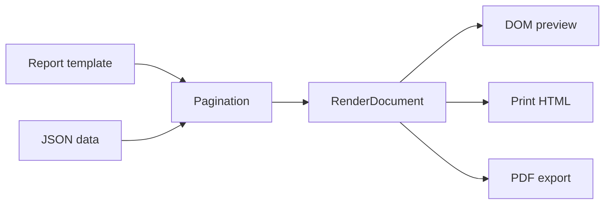

# Band Event Pagination Table Parity Design

## Goal

This round closes the remaining high-risk gap between report preview, browser printing, and PDF export for paginated bands and table components. The product must render the same report structure from one layout contract so that preview, print, and PDF do not drift unless the target page size itself changes.

## Scope

- Complete page-aware band printing rules in the pagination engine.
- Make event-driven component changes participate in the same height calculation used for page breaking.
- Finish table cell style parity across DOM preview, print HTML, and PDF export for the common printable properties already supported by the data model.
- Add focused contract tests before implementation and keep the fixes minimal.

Out of scope:

- Chart printing.
- New data source types beyond JSON.
- Canvas snapping.
- Large redesign of the designer shell.
- New table authoring commands beyond output parity.

## Current Observations

The repository already has the right primitives:

- `packages/core/src/template-model/types.ts` defines `BandPrintOn` and `BandBehavior`.
- `packages/core/src/pagination/paginate.ts` applies basic band behavior during pagination.
- `packages/core/src/layout-engine/layout-band.ts` can run component events while laying out components.
- `packages/viewer/src/renderers/dom/renderComponent.tsx`, `packages/viewer/src/print/print-frame.ts`, and `packages/viewer/src/export/pdf/pdf-draw-component.ts` render the same `RenderDocument` through different surfaces.

The main gaps are narrow but important:

- `lastPage` currently cannot be decided correctly during the first pass, so it needs a post-layout filtering pass.
- `printIfEmpty` exists on the model but is not enforced consistently for bands with no rendered components.
- `placeBand()` estimates height without the event runtime, while final rendering can run events that hide components or change values. That can produce different page breaks.
- Table cells have DOM and print coverage for some styles, but font properties and PDF parity need explicit tests.

## Behavior Contracts

### Band Printing Rules

`BandBehavior.printOn` must behave as follows:

- `allPages`: print wherever the band is otherwise eligible.
- `firstPage`: print only on page 1.
- `exceptFirstPage`: print only on pages after page 1.
- `oddPages`: print on odd page numbers.
- `evenPages`: print on even page numbers.
- `lastPage`: print only on the final rendered page.

`enabled=false` must always skip the band. `visibleExpression` must skip the band when it resolves to false. These checks remain independent from `printOn`.

`printIfEmpty=false` means a band with no rendered components should not be emitted unless it is forced by fixed page infrastructure where the band itself has visible output. A band that only contains hidden components after events counts as empty.

### Last Page Handling

The pagination engine may not know the final page during initial placement. Therefore `lastPage` is handled as a post-layout rule:

1. During placement, defer the page-number decision for `lastPage` so pagination can proceed.
2. After all pages are built and page footers/overlays are applied, remove `lastPage` bands from all pages except the final page.
3. Recompute `totalPages` and page-number fields using the existing page-number pass.

This preserves page production while making the visible result correct.

### Event-Driven Layout

Events can hide a component, cancel it, or change its value through the existing event execution model. The layout estimate used for page breaking must use the same event-aware component output as the final band render.

For this round:

- The preflight layout in `placeBand()` must receive an event runtime with the current page.
- The final layout must not rerun mutable events in a way that causes different output from preflight.
- If the existing event engine cannot make preflight and final render idempotent for all scripts, the pagination code must use a captured event-aware preview result as the final box instead of laying out the band twice.

### Table Output Parity

Table cell rendering must preserve these properties across DOM preview, print HTML, and PDF where technically available:

- `backgroundColor`
- `padding`
- `textAlign`
- `verticalAlign`
- `border`
- `font.family`
- `font.size`
- `font.bold`
- `font.italic`
- `font.underline`
- `font.strikethrough`
- `font.color`

DOM and print HTML use CSS declarations. PDF uses the existing PDF drawing primitives; when underline or strikethrough is not available through text drawing itself, it should be drawn as a line.

## Data Flow

The `RenderDocument` is the single output contract. All viewer surfaces should consume the same styled cell and band boxes instead of recomputing report logic.

## Testing Strategy

Core tests:

- Add print-on matrix coverage for first, except-first, odd, even, and last page behavior.
- Add `printIfEmpty=false` coverage for a band hidden by component events.
- Add event-aware pagination coverage where a component event hides a tall component so the report no longer overflows to an extra page.

Viewer tests:

- Extend table DOM and print tests to include cell font family, size, weight, style, text decoration, and color.
- Extend PDF tests by inspecting drawing calls for table cell font size/color and underline or strikethrough line output.

Regression commands:

- `pnpm --filter @report-designer/core test -- phase-35-band-contracts.test.ts phase-23-render-events.test.ts`
- `pnpm --filter @report-designer/viewer test -- phase-34-table-rendering.test.tsx phase-4-print-frame.test.ts phase-4-pdf-export.test.ts`
- `pnpm test`
- `pnpm build`
- Naming scan for removed external-product and old-version wording.

## Acceptance Criteria

- Band `lastPage` appears only on the final page.
- Empty bands with `printIfEmpty=false` do not leave blank output boxes.
- A component hidden by an event affects page-breaking height exactly as it affects final output.
- Table cell style tests pass for DOM preview, print HTML, and PDF.
- Full test and build commands pass.
- No external product name or old-version marker is introduced in source or docs.
